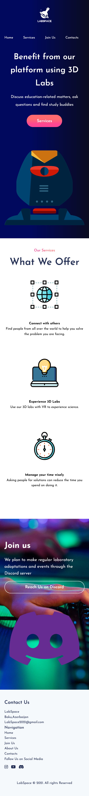

## Table of contents

- [Screenshot](#screenshot)
- [Links](#links)
- [Built with](#built-with)
- [Useful resources](#useful-resources)

### Screenshot

### Links

- Solution URL: [Add solution URL here](https://your-solution-url.com)
- Live Site URL: [Add live site URL here](https://your-live-site-url.com)

### Built with

- Semantic HTML5 markup
- CSS custom properties
- Flexbox
- CSS Grid

### Useful resources

- [CSS Gradient](https://cssgradient.io/) - This tool was used to create gradient background.
- [Box Shadow Generator](https://cssgenerator.org/box-shadow-css-generator.html) - This generator was used to generate box shadow for some of the buttons.
- [SVG Repo](https://www.svgrepo.com/) - A great SVG resource to find relatable svg images.

